# Rendu de JOUIN Pierre

Une capture par étape, dans l'ordre. Terminal entier non rogné, invite visible.
Afficher l'historique en graphe quand c'est pertinent.

## Niveau 1

1. Configuration Git

   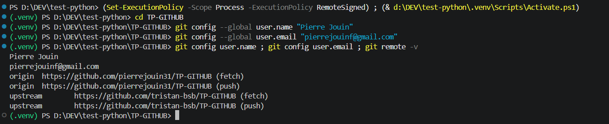

2. Branche de travail

   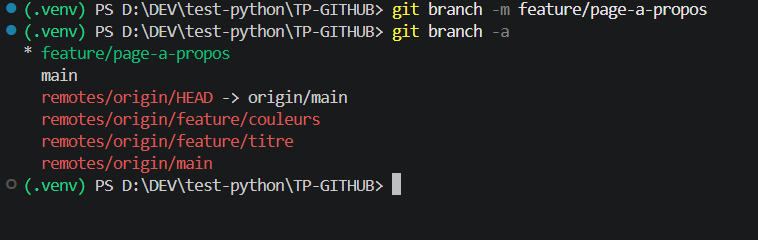

3. Historique des commits

   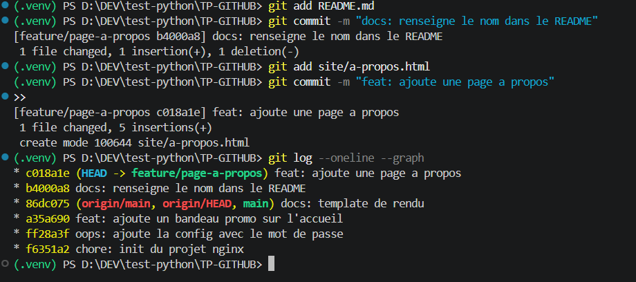

4. Pull Request

   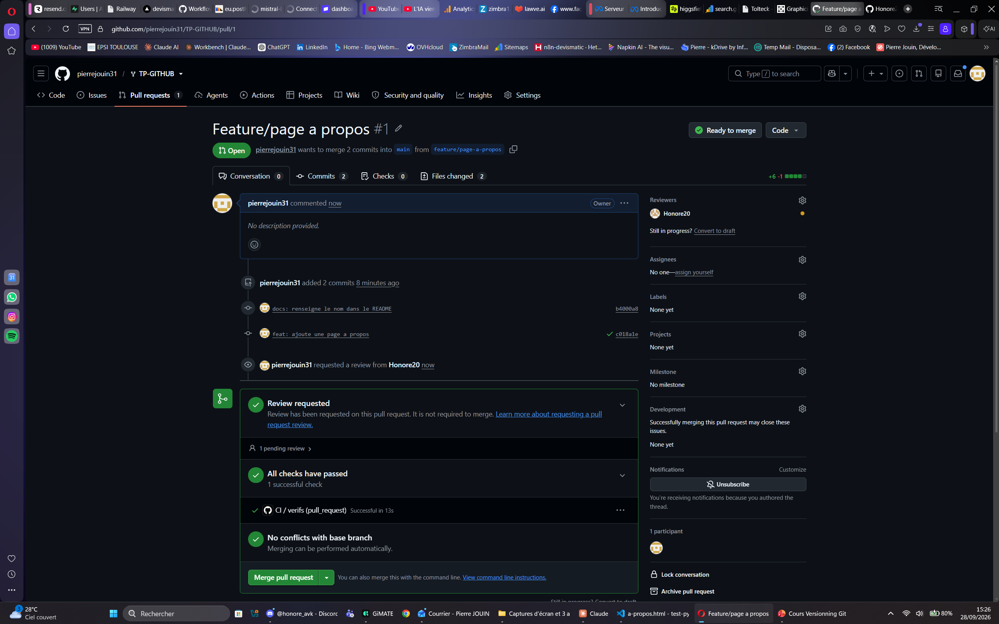

5. Revue croisée

   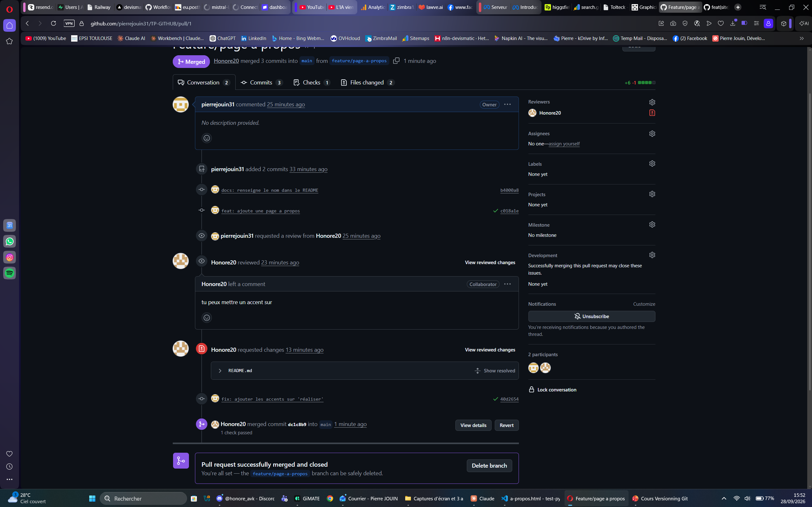

## Niveau 2

6. Secret retiré du suivi

   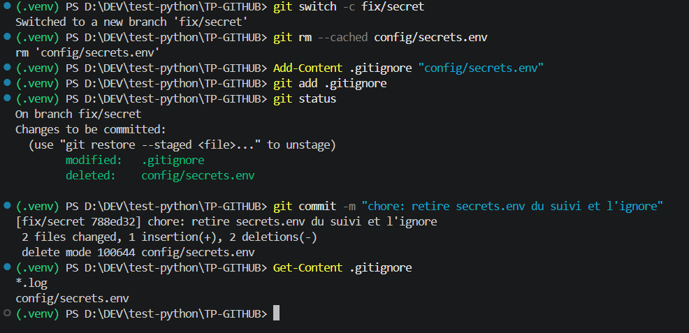

7. Conflit résolu (marqueurs avant, graphe après)

   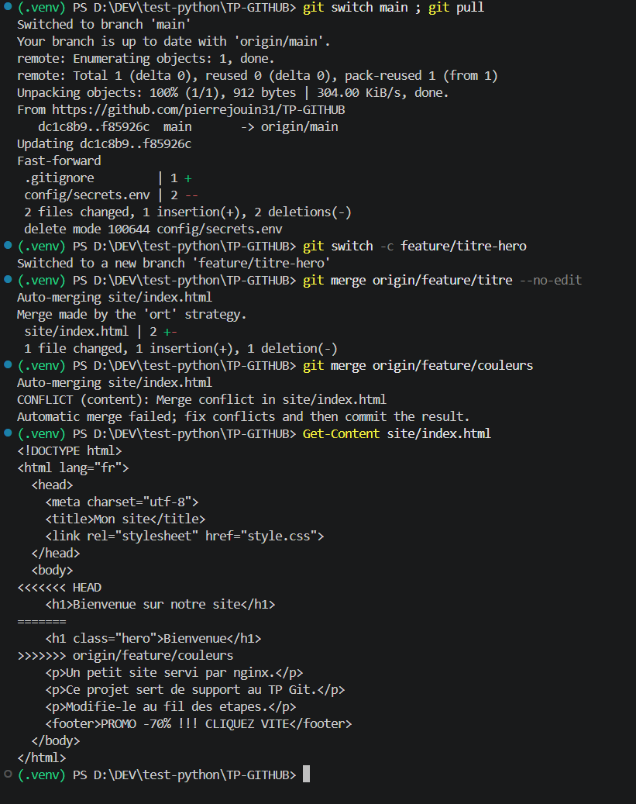

   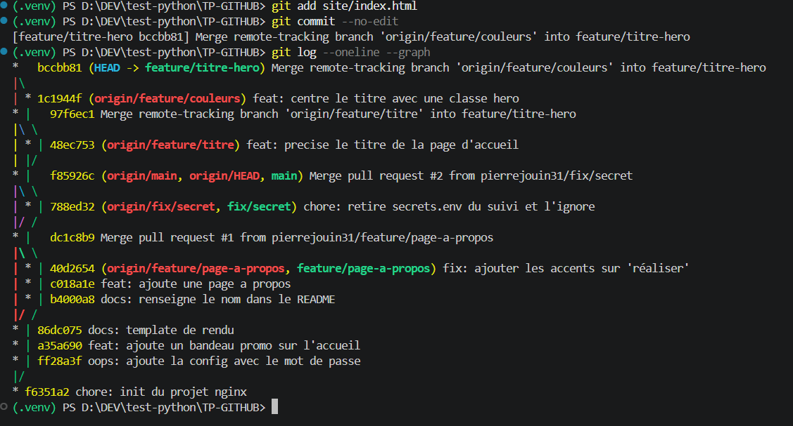

8. Revert du bandeau promo

   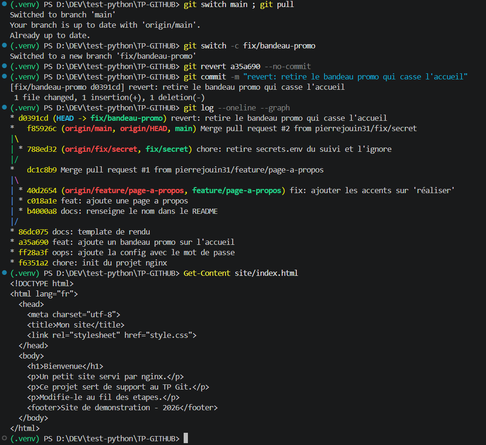

9. Issue fermée par une Pull Request

   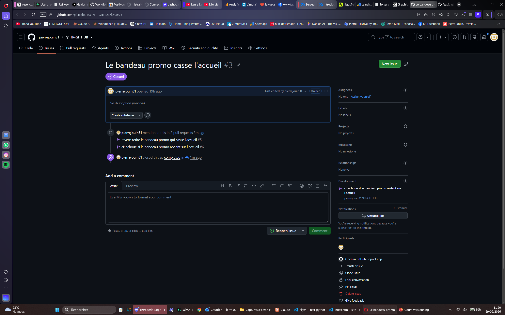

10. Protection de main et CI au vert

    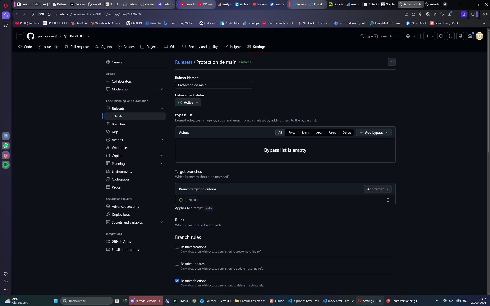

    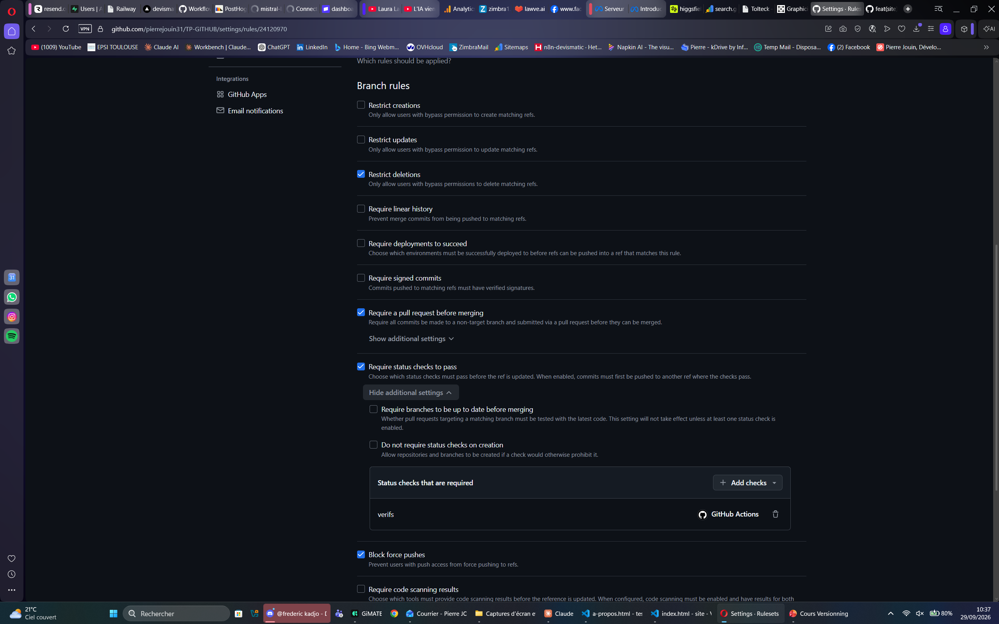

    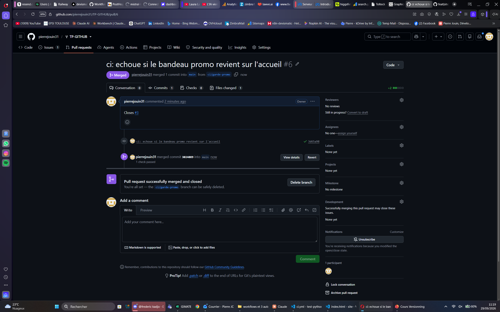

## Cible mobile

11. Commit distant récupéré et conflit résolu

    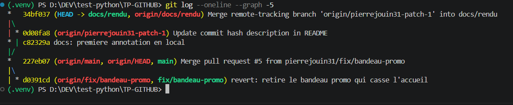

## Trois commits annotés

1. `788ed32` : retire `config/secrets.env` du suivi avec `git rm --cached` et l'ajoute au `.gitignore` pour qu'il ne revienne pas. Le mot de passe reste lisible dans l'historique (commit `ff28a3f`) : en situation réelle, il faudrait le changer et réécrire l'historique.
2. `bccbb81` : fusionne `feature/couleurs` dans ma branche. Les deux branches modifiaient le même `<h1>`. J'ai gardé les deux intentions : la classe `hero` et le nouveau texte du titre.
3. `d0391cd` : annule le bandeau promo avec `git revert`, qui crée un commit inverse sans réécrire l'historique. C'est la bonne méthode sur une branche partagée, contrairement à `reset`.